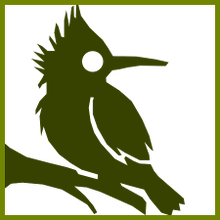

	<!-- Introductory Jumbo -->
	

		
		<!--h1 class="center">Sewerbird</h1>
		<h2 class="center"><small>Blog &amp; Miscellenae</small></h2-->
	

	<!-- Featured Card -->
	
	
		
	<a class="featured card" href="{{ BASE_PATH }}{{ featured_post.url }}" >
		<header>
			<h2>{{ featured_post.title }}</h2>
      <small>featured</small>
		</header>
		<footer>
			<h3>{{ featured_post.tagline }}</h3>
			
{{ featured_post.excerpt | markdownify | strip_html }}

			...click for more!
		</footer>
	</a>
		
	
	<!-- Project Cards -->
	
	
	

		<header>
			<a class="cardtitle" href="{{ BASE_PATH }}{{ project.project_page }}"><h2>{{project.name}}</h2></a>
		</header>
		<footer>
			
{{project.frontpage_blurb}}

			<ul>
			
			
				
				<li><a href="{{ BASE_PATH }}{{ post.url }}">{{ post.title }}</a></li>
				
		  		
			
			</ul>
		</footer>
	

	

